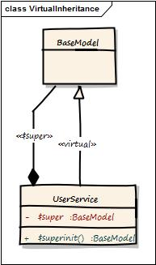

# Virtual Inheritance



You can make two classes blend together simulating a virtual runtime inheritance with WireBox. WireBox will grab the target class and blend into it all of the virtual inheritance class's methods and properties. It will then also create a `$super` reference in the target and a `$superinit()` reference. This is a great alternative to real inheritance and allow for runtime mixins to occur. You start off by mapping the base or source class and then mapping the target class and declaring a virtualInheritance to the base or source class:

```javascript
// Declare base class
map("BaseModel").to("model.base.BaseModel");

map("UserService").to("model.users.UserService").virtualInheritance("BaseModel");
```

This will grab all methods and properties in the `BaseModel` class and mix them into the `UserService`, then create a virtual `$super` scope which will map to an instantiated instance of the `BaseModel` object.
