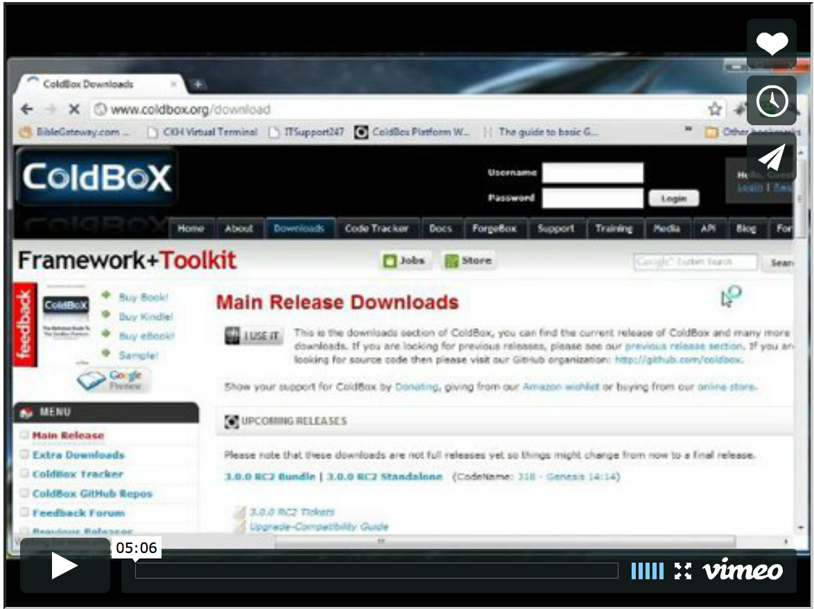

# Installation

If you are using WireBox within a ColdBox application context, then WireBox is part of the platform. Just install ColdBox normally. If you are using WireBox standalone, just drop WireBox in your application root or create a mapping called wirebox that points to the installation folder. If you can run the following snippet, then WireBox is installed correctly:

wirebox = createObject("component","wirebox.system.ioc.Injection").init();

 

<b> Note: Please remember that if you use the standalone version the namespace is wirebox.system.ioc and if you use the ColdBox application version it is coldbox.system.ioc. From this point on, we will use the standalone namespace for simplicity.</b>

 
## WireBox Installation and Introduction

