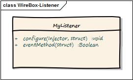

# WireBox Listeners

<figure><figcaption>
A Listener
</figcaption></figure>

In our previous section, we have seen all the events WireBox announces, but how do we listen? There are two ways to build WireBox listeners because there are two modes of operation, but the core is the same.

1. Listeners are simple CFCs who must create methods that match the name of the event they want to listen to.&#x20;
2. If you are running WireBox within a ColdBox application, listeners are [Interceptors](http://coldbox.ortusbooks.com/content/interceptors/interceptors.html) and you declare them and register them the same way you do with normal interceptors.

These methods can take up to two parameters depending on your mode of operation (standalone or ColdBox). The one main difference between pure Wirebox listeners and ColdBox interceptors is that the `configure` method for the standalone WireBox is different.

<table data-view="cards" data-full-width="false"><thead><tr><th></th><th></th><th></th><th data-hidden data-card-target data-type="content-ref"></th></tr></thead><tbody><tr><td>ColdBox Listeners</td><td></td><td></td><td><a href="coldbox-mode-listener.md">coldbox-mode-listener.md</a></td></tr><tr><td>WireBox Listeners</td><td></td><td></td><td><a href="standalone-mode-listener.md">standalone-mode-listener.md</a></td></tr></tbody></table>
