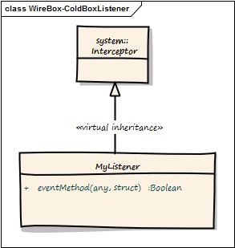

# ColdBox Mode Listener



<table data-header-hidden><thead><tr><th width="129.33333333333331">Argument</th><th width="191">Type</th><th>Description</th></tr></thead><tbody><tr><td><strong>Argument</strong></td><td><strong>Type</strong></td><td><strong>Description</strong></td></tr><tr><td><strong>event</strong></td><td><code>RequestContext</code></td><td>The request context of the running request</td></tr><tr><td><strong>data</strong></td><td><code>struct</code></td><td>The data structure passed in the event</td></tr><tr><td><strong>buffer</strong></td><td><code>RequestBuffer</code></td><td>A request buffer object for producing elegant content in ColdBox applications</td></tr><tr><td><strong>rc</strong></td><td><code>struct</code></td><td>Reference to the <code>rc</code> scope</td></tr><tr><td><strong>prc</strong></td><td><code>struct</code></td><td>Reference to the <code>prc</code> scope</td></tr></tbody></table>

So, let's say we want to listen to the `beforeInjectorShutdown` and the `afterInstanceCreation` event in our listener.

```javascript
component{

    function configure(){}

    function beforeInjectorShutdown(event, data, buffer, rc, prc ){
        var injector = arguments.data.injector;
        // Do my stuff here:

        // I can use a log object because ColdBox is cool and injects one for me already.
        log.info("DUDE, I am going down!!!");
    }

    function afterInstanceCreation(event, data, buffer, rc, prc ){
        var injector = arguments.data.injector;
        var target = arguments.data.target;
        var mapping = arguments.data.mapping;

        log.info("The object #mapping.getName()# has just been built, performing my awesome AOP processing on it.");

        // process awesome AOP on this target
        processAwesomeAOP( target );
    }
}
```
