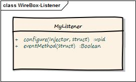

# Standalone Mode Listener



In standalone mode, the listener is a simple CFC with a `configure()` method and any methods that match the name of the events.  Each of these methods receive the following arguments:


<table data-header-hidden><thead><tr><th width="149">Argument</th><th width="92.33333333333331">Type</th><th>Description</th></tr></thead><tbody><tr><td><strong>Argument</strong></td><td><strong>Type</strong></td><td><strong>Description</strong></td></tr><tr><td><strong>data</strong></td><td>struct</td><td>The data structure passed in the event</td></tr></tbody></table>

### Example:

```cfscript
component{

    function configure( injector,properties ){
        variables.injector = arguments.injector;
        variables.properties = arguments.properties;

        log = variables.injector.getLogBox().getLogger( this );
    }

    function beforeInjectorShutdown( data ){
        // Do my stuff here:

        // I can use a log object because ColdBox is cool and injects one for me already.
        log.info("DUDE, I am going down!!!");
    }

    function afterInstanceCreation( data ){
        var target = arguments.data.target;
        var mapping = arguments.data.mapping;

        log.info("The object #mapping.getName()# has just been built, performing my awesome AOP processing on it.");

        // process awesome AOP on this target
        processAwesomeAOP( target );
    }
}
```

Please note the `configure()` method in the standalone listener. This is necessary when using Wirebox listeners outside of a ColdBox application. The `configure()` method receives two parameters:

* `injector` : An instance reference to the calling Injector with which this listener will be registered.
* `properties` : A structure of properties that passes through from the configuration file.

As you can see from the examples above, each component can listen to multiple events.&#x20;

### Order of Execution

Now, you might ask yourself, in what order are these listeners executed? They are executed in the order they are declared in either the ColdBox configuration file as interceptors or the WireBox configuration file as listeners.


**Caution** Order is EXTREMELY important for interceptors/listeners. So please make sure you order them in the declaration file.


### Declaration

You will declare the listeners in the Binder using the `listeners` struct or method approach

* [Data Approach](../../../configuration/configuring-wirebox/data-configuration-settings.md#listeners)
* [Programmatic Approach](../../../configuration/configuring-wirebox/programmatic-configuration.md)

```cfscript
function configure(){
    // Declarative Approach
    wirebox = {
    
        // Register all event listeners here, they are created in the specified order
        listeners = [
            { 
                class="models.MyAuditLog", 
                name="MyAuditLog", 
                properties={ logLevel : "MAX" } 
            }
        ]   
    }
    
    // Programmatic approach
    listener( 
        class      : "models.MyAuditLog", 
        name       : "MyAuditLog", 
        properties : { logLevel : "MAX" }
    );

}
```
