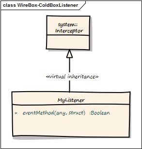

# ColdBox Mode Listener



| **Argument** | **Type** | **Execution Mode** | **Description** |
| --- | --- | --- | --- |
| **event** | coldbox.system.web.context.RequestContext | **coldbox** | The request context of the running request |
| **interceptData** | struct | **standalone-coldbox** | The data structure passed in the event |
| **buffer** | coldbox.system.core.util.RequestBuffer | **ColdBox** | A request buffer object for producing elegant content in ColdBox applications |
| **rc** | struct | **coldbox** | Reference to the `rc` scope |
| **prc** | struct | **coldbox** | Reference to the `prc` scope |

So let's say that we want to listen on the beforeInjectorShutdown and on the afterInstanceCreation event in our listener.

```javascript
component{

    function configure(){}

    function beforeInjectorShutdown(event, interceptData, buffer, rc, prc ){
        var injector = arguments.interceptData.injector;
        // Do my stuff here:

        // I can use a log object because ColdBox is cool and injects one for me already.
        log.info("DUDE, I am going down!!!");
    }

    function afterInstanceCreation(event, interceptData, buffer, rc, prc ){
        var injector = arguments.interceptData.injector;
        var target = arguments.interceptData.target;
        var mapping = arguments.interceptData.mapping;

        log.info("The object #mapping.getName()# has just been built, performing my awesome AOP processing on it.");

        // process awesome AOP on this target
        processAwesomeAOP( target );
    }
}
```

